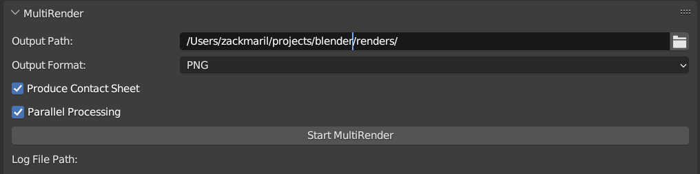
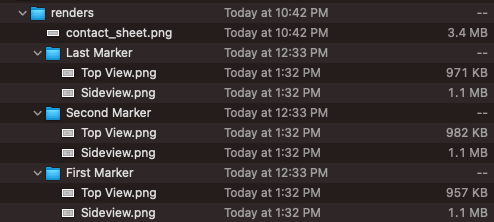
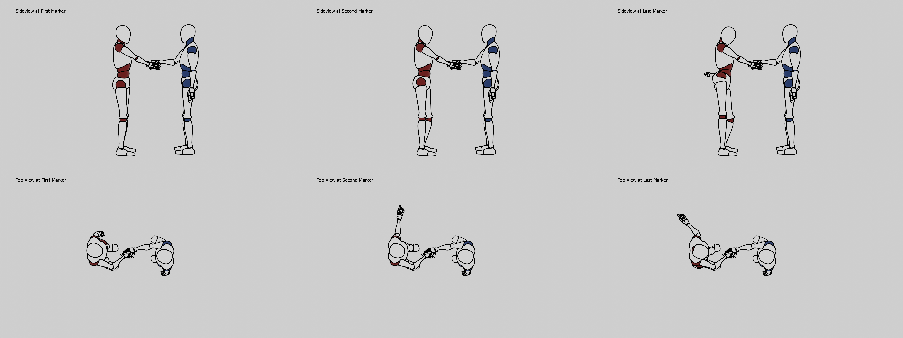

# MultiRender - A Blender Add-on For Easily Rendering Multiple Images From One Blender File 

## Description
MultiRender is a Blender add-on that enables rendering of multiple images with a click of a button, based on cameras and timeline markers in the scene. It can be a useful tool for batch rendering from different viewpoints or at different time instances.

 



## Features
- Renders an image from every camera in the scene for every timeline marker.
- Allows selection of output format: PNG (default), JPEG, or TIFF.
- Allows enabling/disabling of parallel processing for faster renders.
- Intuitive user interface in the Render Properties panel.
- Automatic directory creation and file naming based on marker and camera names.
- Error handling and warnings for scenes without cameras or timeline markers.

## Requirements
- Tested with Blender 3.5.1 or newer, might work with older versions but not aiming for backwards compatibility at this time. 

## Installation
1. Download the MultiRender Python script (`multirender.py`) from the repository.
2. Open Blender and go to `Edit > Preferences`.
3. In the Preferences window, switch to the `Add-ons` tab and click on `Install...` button.
4. Navigate to where you downloaded the `multirender.py` script, select it, and click `Install Add-on`.
5. The add-on should now appear in the add-on list. Check the box next to it to enable it.

## Dependencies

The "Produce Contact Sheet" feature requires the Pillow library to be installed in your Blender's Python environment. You can install it by opening Blender's Python console (Window > Toggle System Console) and running the following command:

```
python -m ensurepip && python -m pip install pillow
```

If you are having difficulties with this step, I found [this StackOverflow answer very helpful](https://blender.stackexchange.com/questions/56011/how-to-install-pip-for-blenders-bundled-python).

## Usage
1. Once installed, you can find the MultiRender panel in the `Render Properties` tab.
2. Set your preferred output format and output directory.
3. If desired, enable parallel processing for faster renders.
4. Click the `Start MultiRender` button to begin the batch rendering process.

Optionally, you can enable the "Produce Contact Sheet" option to create a composite image of all the rendered images. Each row of the composite image represents a different camera and each column represents a different marker. Note that this feature requires the Pillow library to be installed in your Blender's Python environment.
 
## Development
The MultiRender add-on is open-source and contributions are welcome. You can clone the repository and start making improvements. Make sure to test your changes locally before making a pull request. The first pass of this plugin was written with and by ChatGPT ([link](https://chat.openai.com/share/edf6eefb-2061-4a1f-84d2-c309a555a925)). 

## Inspiration 

I got tired of clicking buttons a lot. I wanted to render a bunch of images from a bunch of cameras at a bunch of different times. I didn't want to click a bunch of buttons. So I wrote this add-on to do it for me. [Renderburst served as an inspiration](https://github.com/VertStretch/RenderBurst) but I wanted to do it a little differently and also learn how to write a Blender add-on myself. 

## Support
If you encounter any issues or have suggestions for improvements, please open an issue on the repository page.

## License
This project is licensed under the terms of the MIT license. For more information, see the `LICENSE` file in the repository.
